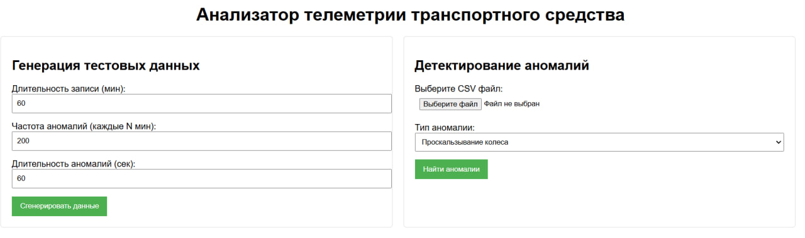

# Система обнаружения аномалий в телеметрии транспортных средств

Этот проект предоставляет решение для генерации и обнаружения аномалий в данных телеметрии транспортных средств. Система включает возможности генерации данных, обучения моделей и обнаружения аномалий.

## Основные возможности

- Генерация синтетических телеметрических данных с настраиваемыми аномалиями
- Обнаружение аномалий моделью RandomForrest
- REST API для взаимодействия с системой
- Визуализация сгенерированных данных


## TEST METRICS на датасете из demo_data:
```
              precision    recall  f1-score   support

    gps_loss     0.9832    0.9688    0.9759      1089
      normal     0.9960    0.9979    0.9970      9201
  wheel_slip     0.9994    0.9982    0.9988      1708
    accuracy                         0.9953     11998
   macro avg     0.9929    0.9883    0.9906     11998
weighted avg     0.9953    0.9953    0.9953     11998
```

## Выбор модели: Random Forest

Для решения задачи обнаружения аномалий в телеметрии был выбран алгоритм Random Forest, что обусловлено следующими ключевыми преимуществами:

1. **Эффективность на данных средней сложности**  
   Сгенерированные признаки (производные величины, скользящие статистики) достаточно хорошо описывают временные закономерности в данных, что позволяет Random Forest достигать высокой точности без избыточной сложности модели.

2. **Устойчивость к переобучению**  
   Благодаря механизму бэггинга и случайному выбору признаков, Random Forest демонстрирует стабильную работу даже при наличии шумов в данных, что критически важно для задач детектирования аномалий.

3. **Быстрое обучение**  
   Для данных такого объема и структуры Random Forest показывает оптимальное соотношение скорости обучения и качества предсказаний.

Для более сложных случаев (высокочастотные данные, большее количество типов аномалий и большая сложность аномалий) можно рассмотреть:
- Градиентный бустинг (XGBoost, CatBoost)
- Временные модели (LSTM, Transformer)
- Гибридные подходы, сочетающие несколько алгоритмов

Текущая реализация на Random Forest обеспечивает хороший баланс между точностью, скоростью работы и простотой поддержки, что идеально соответствует требованиям MVP системы.
## Использование

### 1. Генерация тестового набора данных

Сгенерируйте набор данных с аномалиями:
```bash
python generate_dataset.py --duration 60 --anomaly_freq 200 --anomaly_len 60 --dataset_name dataset.csv --graphics_name plot.png
```

Параметры:
- `--duration`: Длительность в минутах (минимум 60)
- `--anomaly_freq`: Частота аномалий в секундах
- `--anomaly_len`: Длительность каждой аномалии в секундах
- `--dataset_name`: Имя выходного CSV-файла
- `--graphics_name`: Имя выходного файла с графиком

### 2. Обучение модели

Обучите модель обнаружения аномалий:
```bash
python train.py
```

Это выполнит:
- Генерацию обучающего и тестового наборов данных
- Обучение классификатора RandomForest
- Сохранение модели в `models/random_forest_model.pkl`
- Вывод метрик оценки


### 3. Обнаружение аномалий через CLI

Обнаружение аномалий в наборе данных:
```bash
python anomaly_detector.py --dataset путь/к/файлу.csv --anomaly wheel_slip --model_path models
```

Параметры:
- `--dataset`: Путь к входному CSV-файлу
- `--anomaly`: Тип аномалии для обнаружения (`wheel_slip` или `gps_loss`)
- `--model_path`: Путь к директории с обученными моделями

### 4. Запуск веб-приложения

Запустите Flask-сервер:
```bash
python app.py
```
Приложение будет доступно по адресу `http://localhost:5000`
Внутри него можно сделать генерацию данных и детектировать аномалии

## Структура проекта

```
.
├── models/               # Сохраненные ML-модели
├── uploads/              # Временные загруженные файлы
├── results/              # Сгенерированные наборы данных и графики
├── app.py                # Flask-приложение
├── anomaly_detector.py   # Логика обнаружения аномалий
├── config.py            # Параметры конфигурации
├── generate_dataset.py   # Генерация данных
├── train.py             # Обучение модели
└── requirements.txt     # Зависимости
```

## Конфигурация

Отредактируйте `config.py` для настройки:
- Радиуса колеса
- Ограничений скорости
- Параметров модели
- Путей к файлам

